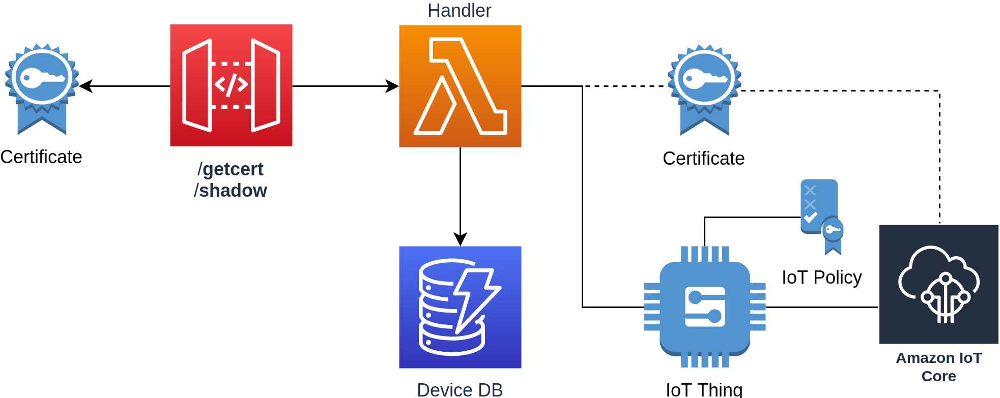

# Serverless Certificate Vending Machine

Based on [awslabs/aws-iot-certificate-vending-machine](awslabs/aws-iot-certificate-vending-machine) this deployment uses Serverless framework instead



## Setup Serverless

```bash
npm install -g serverless
serverless config credentials --provider aws --key <ACCESS KEY ID> --secret <SECRET KEY>
```

## Requirements

```bash
serverless plugin install -n serverless-pseudo-parameters
```

Add the following to the `serveress.yml` file

```yaml
plugins:
  - serverless-pseudo-parameters
```

### Env File

Create a copy of `env.yml.sample` as `env.yml` and update the `IOT_DATA_ENDPOINT` variable with the endpoint address from the following commnad

```bash
aws iot describe-endpoint --endpoint-type iot:Data-ATS

# {
#     "endpointAddress": "XXXXXX-ats.iot.us-east-1.amazonaws.com"
# }
```

## Deploy

```bash
npm install
serverless deploy

# api keys:
#   None
# endpoints:
#   GET - https://XXXXXX.execute-api.us-east-1.amazonaws.com/dev/getcert
#   ANY - https://XXXXXX.execute-api.us-east-1.amazonaws.com/dev/shadow
# functions:
#   cvm: serverless-cvm-dev-cvm
# layers:
#   None
```

## Create Device

Replace the device token with something secure and add a new entry to the DB

```bash
aws dynamodb put-item \
  --table-name iot-cvm-device-info \
  --item '{"deviceToken":{"S":"1234567890"},"serialNumber":{"S":"devopstar-iot-01"}}'
```

### Retrieve Certificates

Run the following command to generate the certificates based on the json recieved from the request.

*Note: You'll need `jq` installed for this*

```bash
./create_certs.sh "https://XXXXXX.execute-api.us-east-1.amazonaws.com/dev/getcert?serialNumber=devopstar-iot-01&deviceToken=1234567890"
```

This should create your certs in the following files based on the json keys

* **iot-certificate.pem.crt**: certificatePem
* **iot-private.pem.key**: keyPair.PrivateKey
* **iot-root-ca.crt**: RootCA

### Shadow State

#### PUT Shadow State

```bash
curl \
  -d '{"deviceAttribute":"CVM"}' \
  -X PUT "https://XXXXXX.execute-api.us-east-1.amazonaws.com/dev/shadow?serialNumber=devopstar-iot-01&deviceToken=1234567890"
```

#### GET Shadow State

```bash
curl -X GET "https://XXXXXX.execute-api.us-east-1.amazonaws.com/dev/shadow?serialNumber=devopstar-iot-01&deviceToken=1234567890"
```

## Attribution

* [awslabs/aws-iot-certificate-vending-machine](https://github.com/awslabs/aws-iot-certificate-vending-machine)
* [Support re-issue certificates; Updated CF to use SAM; Upgrade to nodejs8 /w promises](https://github.com/brightsparc/aws-iot-certificate-vending-machine)
